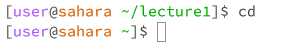
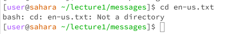
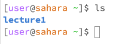
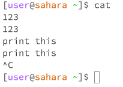
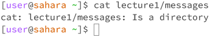
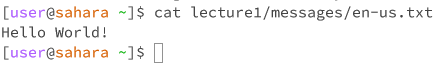

# 1.cd

 (1) * The working directory is in /home/lecture1
 * The single cd with no argument takes us to the home directory.
 * It is not an error.

 (2) * The working directory is in /home
 * The cd with argument "lecture1/messages" changes the directory to /home/lecture1/messages.
 * There is no error.

 (3) * The working directory is in /home/lecture1/messages
 * The cd with argument "en-us.txt" is used to find the folder en-us.txt under messages.
 * There is an error because en-us.txt is not a folder but a file.
# 2.ls

 (1) * The working directory is in /home
 * The single ls with no argument just lists the files or folders under the current working directory, so it prints lecture1.
 * There is no error.

 (2) * The working directory is in /home
 * The ls with argument "lecture1" lists files or folders under the directory of /home/lecture1, so it prints "Hello.class Hello.java messages README".
 * There is no error.

 (3) * The working directory is in /home/lecture1
 * Since messages/en-us.txt is not a directory but a file path, there is no file to list. So it just prints the "messages/en-us.txt".
 * I think it is not an error.

# 3.cat

 (1) * The working directory is in /home
 * After typing the single cat with no argument, it takes me to a new line. Then I type 123 and it prints 123. When I type "print this". it prints "print this". It seems that the cat with no argument will return the content of what you typed. Finally, I typed ^C to finish it.
 * It is not an error.

 (2) * The working directory is in /home
 * The cat with the argument "lecture1/messages" wants to print the contents of the file this path is given.
 * There is an error because lecture1/messages is a directory but not a file.

 (3) * The working directory is in /home
 * The command cat with the argument /lecutre1/messages/en-us.txt prints the content of "en-us.txt", which is "Hellow, world!"
 * There is no error.
