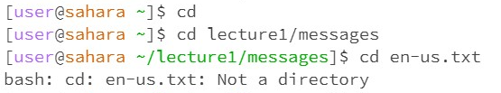

# 1.cd

// (1) * The working directory is in \home
    * The single cd with no argument did not change the directory, so there is no change or lines popped out.
    * There is no output, so it is not an error.
