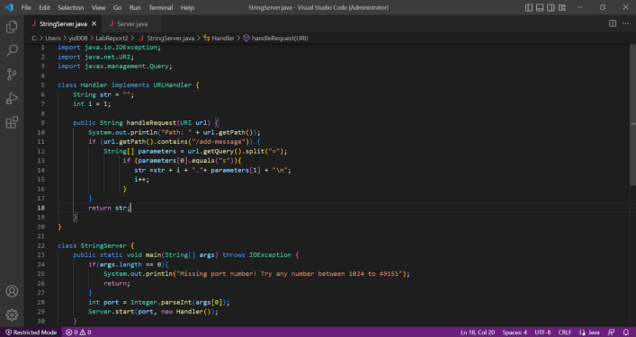
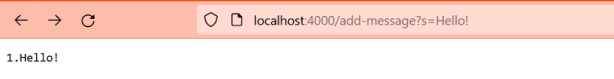
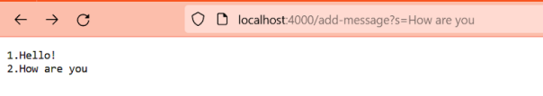
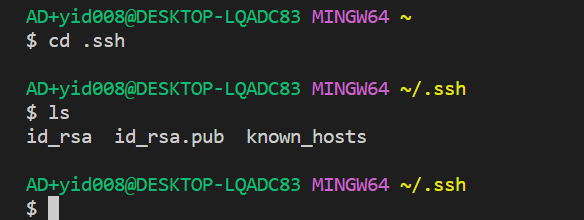
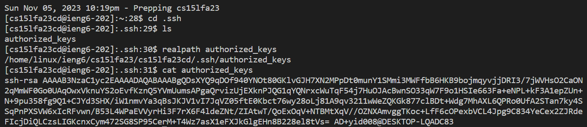

# 1. Part 1

 
 (1) The methods public String handleRequest and public static void main are called.
 (2) For the method public String handleRequest the argument is URI url, and the value is String[] parameters. For the main method, the argument is String[] args and the value is int port.
 (3) For the class Handler, URI url changes to http://localhost:4000/add-message?s=Hello!, String str changes to 1. Hello! + "\n". For the class StringServer, int port changes to 4000.
 
 (1)The methods public String handleRequest and public static void main are called.
 (2)For the method public String handleRequest the argument is URI url, and the value is String[] parameters. For the main method, the argument is String[] args and the value is int port.
 (3)For the class Handler, URI url changes to http://localhost:4000/add-message?s=How%20are%20you, String str changes to “1. Hello!” + "\n" + “2. How are you” +  "\n". For the class StringServer, int port changes to 4000.
# 2. Part 2
(1)
 
<be>(2)
 
 (3)
<be>!{Image](NoPassword.png)
# 3. Part 3
I learned how to write a web server that I hadn’t heard about before. I used to think that it would be very complicated to write a website, but now I have learned the handleRequest method to update the strings and change some numbers.

