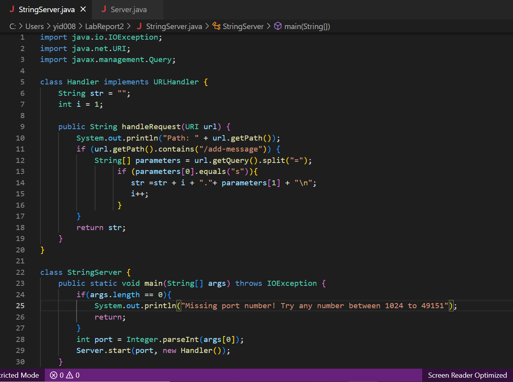
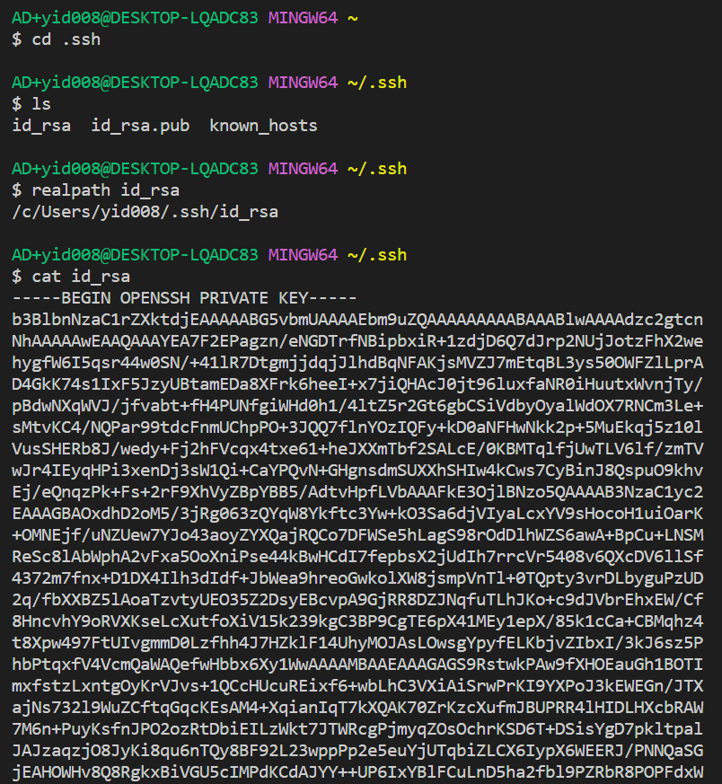
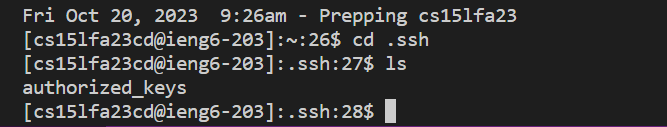
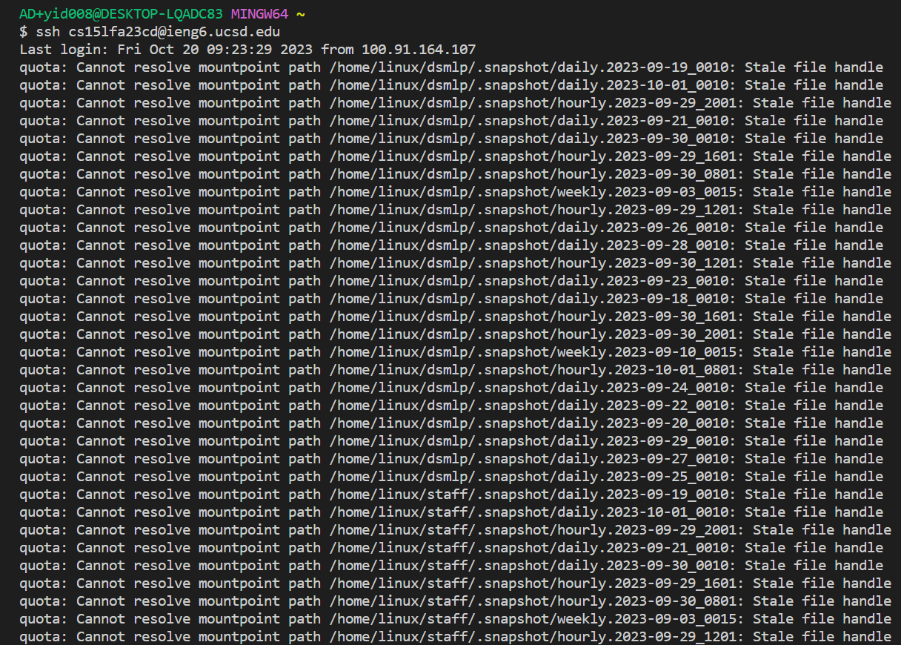

# 1. Part 1

 
 (1) The methods public String handleRequest(), getPath(), equals(), contains(), getQuery(), split(), and public static void main are called.
 (2) For the method public String handleRequest the argument is URI url = http://localhost:4000/add-message?s=Hello!, and the value is String[] parameters, which split the string from "=". So one string is the piece before the "=" and the other one is the piece after the"=". Then the equals() check if the first string in the created array is "s" or not. For the main method, the argument is String[] args and the value is int port 4000.
 (3) For the class Handler, URI url changes to http://localhost:4000/add-message?s=Hello!, the int variable num changes from 0 to 1, String str changes to ""1. Hello!" + "\n"". Finally, str is returned by the method.:
 
 (1)The methods public String handleRequest(), getPath(), equals(), contains(), getQuery(), split(), and public static void main are called.
 (2)For the method public String handleRequest the argument is URI url = http://localhost:4000/add-message?s=How%20are%20you, and the value is String[] parameters, which split the string from "=". So one string is the piece before the "=" and the other one is the piece after the"=". Then the equals() check if the first string in the created array is "s" or not. For the main method, the argument is String[] args and the value is int port 4000.
 (3)For the class Handler, URI url changes to http://localhost:4000/add-message?s=How%20are%20you,the int variable num changes from 1 to 2. String str changes to "“1. Hello!” + "\n" + “2. How are you” +  "\n"". Then it is returned and displayed on the page.
# 2. Part 2
(1) Private key
 
 (2) Public key
  
 (3) Log into ieng6 without being asked for a password
  
# 3. Part 3
I learned how to write a web server that I hadn’t heard about before. I used to think that it would be very complicated to write a website, but now I have learned the handleRequest method to update the strings and change some numbers.

