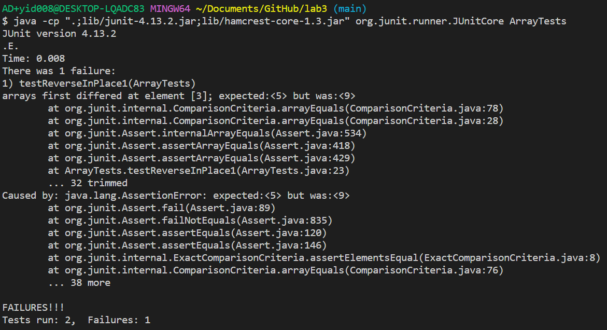

# 1. Part 1 - Bugs
(1) A failure-inducing input for the buggy program:
```
@Test 
public void testReverseInPlace1() {
  int[] input1 = { 3, 5, 7, 9, 11 };
  ArrayExamples.reverseInPlace(input1);
  assertArrayEquals(new int[]{ 11, 9, 7, 5, 3 }, input1);
}
```
(2) An input that doesn’t induce a failure:
```
@Test 
public void testReverseInPlace2() {
  int[] input1 = { 3 };
  ArrayExamples.reverseInPlace(input1);
  assertArrayEquals(new int[]{ 3 }, input1);
}
```
(3) The symptom, as the output of running the tests:
 <br>
(4) The buggy code:
```
static void reverseInPlace(int[] arr) {
  for(int i = 0; i < arr.length; i += 1) {     
    arr[i] = arr[arr.length - i - 1];
  }    
}
```
The fixed code:
```
static void reverseInPlace(int[] arr) {
  for(int i = 0; i < arr.length/2; i += 1) {  
    int temp = arr[i];
    arr[i] = arr[arr.length - i - 1];
    arr[arr.length - i - 1] = temp;
  }
}
```
Explanation: The original code has a bug in the line "arr[i] = arr[arr.length - i - 1];" within the loop. This line tries to reverse the array in place, but it's overwriting the elements with incorrect values instead. It assigns each element at index i to the value at position "arr.length - i - 1". So in my fixed code, "int temp = arr[I];" stores the value of the current element (arr[i]) in a temporary variable temp. Then in line "arr[i] = arr[arr.length - i - 1];", it sets the value of "arr[I]" to the corresponding element from the end of the array. Finally, "arr[arr.length - i - 1] = temp;" assigns the value stored in "temp". However, there may still be some problems in the fixed code. For instance, I should add an if statement to check whether the input array is null. If so, the method should throw a NullPointerException.
# 2. Part 2 - Researching Commands
(1) "grep -c": displays the count of matching lines instead of the actual lines (resource: https://www.geeksforgeeks.org/grep-command-in-unixlinux/)
<br> Example 1:
```
AD+yid008@DESKTOP-LQADC83 MINGW64 ~/Documents/GitHub/docsearch/technical/911report (main)
$ grep -c "flight" *.txt
chapter-1.txt:74
chapter-10.txt:10
chapter-11.txt:7
chapter-12.txt:5
chapter-13.1.txt:0
chapter-13.2.txt:39
chapter-13.3.txt:9
chapter-13.4.txt:28
chapter-13.5.txt:50
chapter-2.txt:1
chapter-3.txt:14
chapter-5.txt:27
chapter-6.txt:15
chapter-7.txt:59
chapter-8.txt:8
chapter-9.txt:3
preface.txt:0
```
This command line prints a count of lines in each file in the folder 911 report that contains the word "flight". We can see most of the files contain many lines with the word "flight", which is consistent with the topic -- 911report. In this way, we can know the main thing that happened in 911 was about the flight.
<br> Example 2:
```
AD+yid008@DESKTOP-LQADC83 MINGW64 ~/Documents/GitHub/docsearch/technical/government/About_LSC (main)
$ grep -c "gender" *.txt
Comments_on_semiannual.txt:1
commission_report.txt:0
conference_highlights.txt:0
CONFIG_STANDARDS.txt:1
diversity_priorities.txt:5
LegalServCorp_v_VelazquezDissent.txt:0
LegalServCorp_v_VelazquezOpinion.txt:0
LegalServCorp_v_VelazquezSyllabus.txt:0
ODonnell_et_al_v_LSCdecision.txt:0
ONTARIO_LEGAL_AID_SERIES.txt:0
Progress_report.txt:2
Protocol_Regarding_Access.txt:0
reporting_system.txt:0
Special_report_to_congress.txt:0
State_Planning_Report.txt:0
State_Planning_Special_Report.txt:0
Strategic_report.txt:2
```
This command line prints a count of lines in each file in the folder government/About_LSC that contains the word "gender". By using this command, we can know which file is talking about the gender topic and which file considers more about the gender topic.<br>
(2) "grep -n": displays line numbers along with the matching lines (resource: https://www.geeksforgeeks.org/grep-command-in-unixlinux/)
<br> Example 1:
```
AD+yid008@DESKTOP-LQADC83 MINGW64 ~/Documents/GitHub/docsearch/technical/government/About_LSC (main)
$ grep -n "gender" diversity_priorities.txt
19:age, gender, disability, sexual orientation, race, ethnicity and
138:greater gender diversity and pursued activities to bring women into
160:transgendered persons, persons with AIDS, children, homeless
170:transgendered persons, people of color, people from diverse
418:religious groups and gays/lesbians/bi-sexual and transgender
```
Since this command displays the lines containing "gender" and their line numbers, it makes it easier for us to locate which part is talking about the gender topic in the file.
<br> Example 2:
AD+yid008@DESKTOP-LQADC83 MINGW64 ~/Documents/GitHub/docsearch/technical/911report (main)
```
$ grep -n "kill" chapter-2.txt
19:            He claimed it was more important for Muslims to kill Americans than to kill other
20:                infidels." It is far better for anyone to kill a single American soldier than to
36:            Though novel for its open endorsement of indiscriminate killing, Bin Ladin's 1998
43:                Kingdom. It praised the 1983 suicide bombing in Beirut that killed 241 U.S. Marines,
64:                historical moment. How did Bin Ladin-with his call for the indiscriminate killing of
214:                especially clear in Egypt. Confronted with a violent Islamist movement that killed
259:                enormous number trained only in religious schools, lacked the skills needed by their
260:                societies. Far more acquired valuable skills but lived in stagnant economies that
266:                abroad, lacked the perspective and skills needed to understand a different culture.
312:                appeared to be ungainly but was in fact quite athletic, skilled as a horseman,
365:                November 24, 1989, when a remotely controlled car bomb killed Azzam and both of his
366:                sons. The killers were assumed to be rival Egyptians. The outcome left Bin Ladin
507:                where U.S. troops routinely stopped en route to Somalia, killing two, but no
524:                were killed. The Saudi government arrested four perpetrators, who admitted being
533:                Americans were killed, and 372 were wounded. The operation was carried out
543:            Another scheme revealed that Bin Ladin sought the capability to kill on a mass scale.
553:                One of the al Qaeda representatives explained his mission: "it's easy to kill more
573:                killed 241 U.S. Marines in Lebanon in 1983. The relationship between al Qaeda and
613:                1995 appears to have been a tipping point. The would-be killers, who came from the
657:                ambitions and organizational skills. He returned to Afghanistan.
687:                men with no marketable skills but with deeply held Islamic views.
935:            The attack on the U.S. embassy in Nairobi destroyed the embassy and killed 12
937:                attack on the U.S. embassy in Dar es Salaam killed 11 more people, none of them
940:                without assaulting them, even if this involved the killing of Muslims, this is
```
Since this command displays the lines containing "kill" and their line numbers, it makes it easier for us to locate which part is talking about the number of casualties on 9/11. <br>
(3) "grep -w": displays lines with whole words that match the specified pattern (resource: https://www.geeksforgeeks.org/grep-command-in-unixlinux/)
<br> Example 1:
```
AD+yid008@DESKTOP-LQADC83 MINGW64 ~/Documents/GitHub/docsearch/technical/biomed (main)
$ grep -w "intersect" *.txt
1471-2121-3-4.txt:          regions intersect, producing stationary rings. We
1471-2172-3-16.txt:        signal transduction pathways could intersect the default
1471-2474-4-4.txt:          each selected candidate intersect near or at the midpoint
```
This command ensures that we only get lines that have the whole word "intersect" but not something like "intersection" in the files in biomed folder.
<br> Example 2:
```
AD+yid008@DESKTOP-LQADC83 MINGW64 ~/Documents/GitHub/docsearch/technical/plos (main)
$ grep -w "develop" journal.pbio.0020010.txt
        to become the hallmark of the new open-access initiatives as they develop.
        others to develop services that are more in accord with 2003 than 1993. One lesson Roger
```
This command ensures that we only get lines that have the whole word "develop" but not something like "development" in the file. <br>
(4) "grep -i": matches the search pattern regardless of whether the characters are in uppercase or lowercase (resource: https://www.geeksforgeeks.org/grep-command-in-unixlinux/)
<br> Example 1:
```
AD+yid008@DESKTOP-LQADC83 MINGW64 ~/Documents/GitHub/docsearch/technical/biomed (main)
$ grep -i "study" 1468-6708-3-1.txt
        events [ 10 ] . In this paper we study whether BMI at
          Study design: The Cardiovascular Health
          Study
          The Cardiovascular Health Study (CHS) is a
          population-based longitudinal study of 5,888 adults aged
        from EVGFP) in the first seven years of the study, adjusted
        CHS Cardiovascular Health Study
```
This command ensures selecting both "study" and "Study" in the file. So uppercase or lowercase does not matter in this case.
<br> Example 2:
```
AD+yid008@DESKTOP-LQADC83 MINGW64 ~/Documents/GitHub/docsearch/technical/plos (main)
$ grep -i "for" pmed.0020281.txt
        forces that zealously guard their secrets could not have been told without the help of
        courageous men and women [1, 2] For that reason, those of us who congregated in Washington,
        sponsors. Our convictions could not have been aired were it not for the essential First
        For me, whistleblowing is not a theoretical exercise. It has a human face and tangible
        passionate, and often successful, because our efforts have a different goal than the
        is to tell the truth. That honest effort is the source of any ethical difference we can or
        might make. Truth is the basis for the power of a whistleblower, one that can withstand the
        assault of unprecedented odds against being heard put forth by that sum of political power,
        success (I have adapted his comments for all of us who gathered in Washington in mid-May
```
This command ensures selecting both "for" and "For" in the file. So uppercase or lowercase does not matter in this case.
