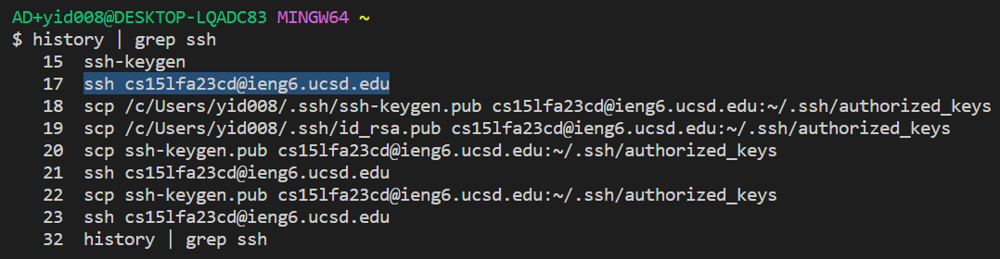
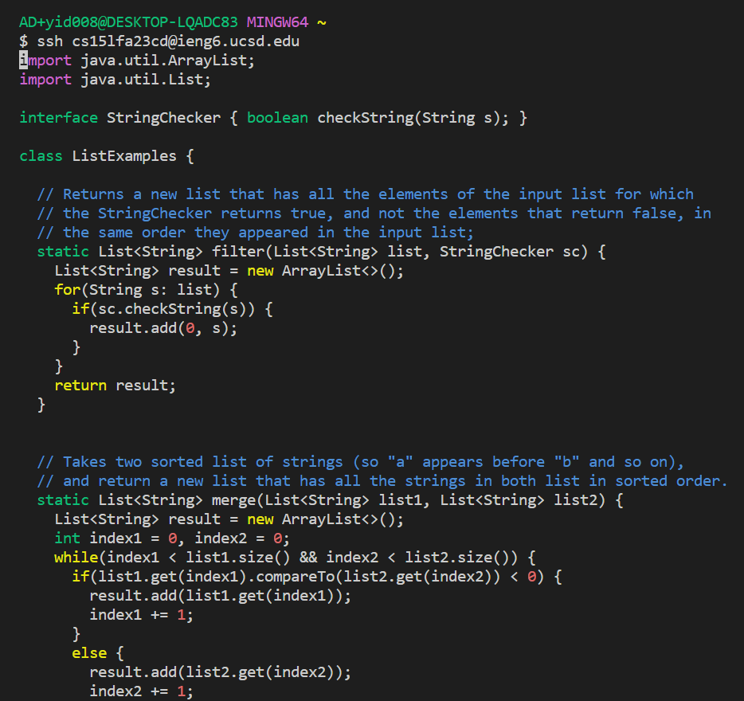
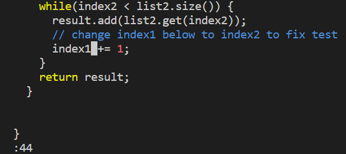
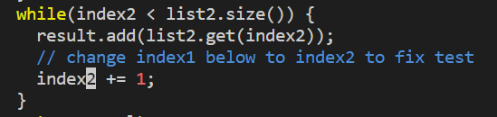
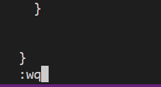
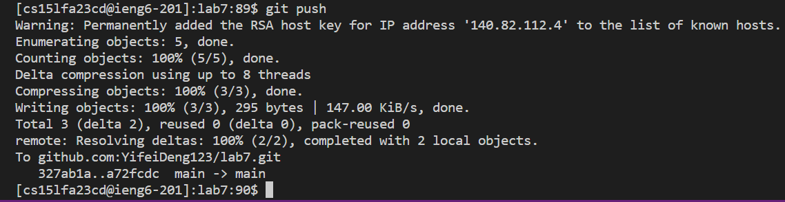
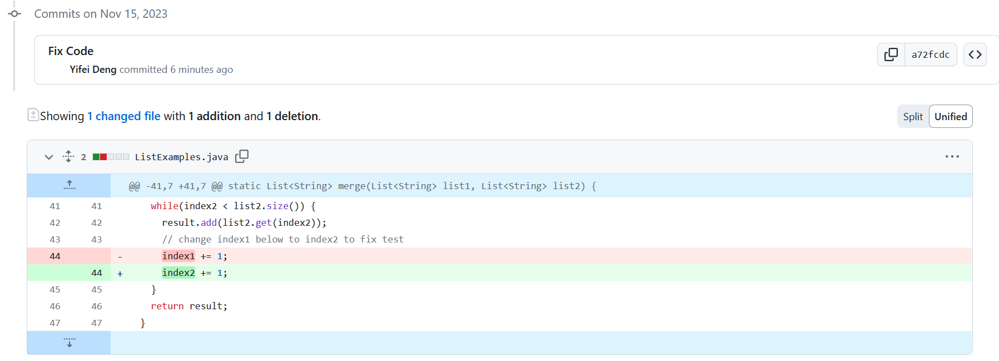

## Step 4: Log into ieng6
  
  I first typed the command "history | grep ssh" to look up my terminal history containing "ssh" so that I could find the command used to log in to ieng6. 

  
Then, I selected "ssh cs15lfa23cd@ieng6.ucsd.edu" and used &lt;ctrl-c&gt and &lt;ctrl-v&gt to copy and paste the command. Next, I pressed the key &lt;enter&gt; to execute the command. Since I have set up the keys for easy access, I don't need to enter my password.
## Step 5: Clone your fork of the repository from your Github account
  
  To clone the repository, I first used  &lt;ctrl-c&gt; to copy the SSH link from my GitHub. Next, I typed "git clone " and used &lt;ctrl-v&gt to paste the URL "git@github.com:YifeiDeng123/lab7.git" after "git clone ". To execute the command I pressed the key &lt;enter&gt;. 
## Step 6: Run the tests, demonstrating that they fail
  
  To run the test, I first typed "ls" to check whether lab7 has been cloned successfully. Then I typed "cd lab7" to go into lab7's directory. Next, I used &lt;up&gt; arrow to retrieve the "ls" command to check the files in the folder of lab7. Finally, I typed the command "bash test.sh" and then pressed the key &lt;enter&gt; to execute the command. It shows that 2 tests were run but 1 test was failed.
## Step 7: Edit the code file to fix the failing test
  
To edit the code file, I first opened ListExamples.java in vim by typing the command "vim ListExamples.java" and then pressed the &lt;enter&gt; key to execute the command.

   
Now I am in the normal mode of vim. First, I need to navigate to "index1" in the final loop in the merge method in order to change it to "index2".  

   
To do so, I typed ":44" and pressed &lt;entere&gt; to get to the beginning of the line where I would make the change. Then I pressed the right arrow key 6 times to get to the place that I wanted to edit. 

   
After that, I pressed "i" to get into the insert mode. Next, I pressed &lt;backspace&gt; and typed "2" to change "index1" to "index2".

   
Finally, I pressed the key &lt;esc&gt; to return to the normal mode and typed ":wq" to save and exit the vim.
## Step 8: Run the tests, demonstrating that they now succeed
  
  To rerun the test, I pressed the &lt;up&gt; arrow key to retrieve my command history of "bash test.sh". Then I pressed the &lt;enter&gt; key to run the test. Now both tests passed.
## Step 9: Commit and push the resulting change to your Github account
   
Firstly, I typed "git status" to check the status of my file. As we can see, the ListExamples.java has been modified.
   
Then, I typed "git add L" and pressed &lt;tab&gt;&lt; to help me complete the rest name, which is "istExamples". Then I typed ".java" after that and pressed the &lt;enter&gt;&lt; key. Next, I typed "git commit -m "Fix Code"" to commit my changes with the message "Fix Code". 

   
Finally, I typed "git push" to push the resulting change to my GitHub account.

  
As we can see, GitHub has shown the resulting change.
