## Step 4: Log into ieng6
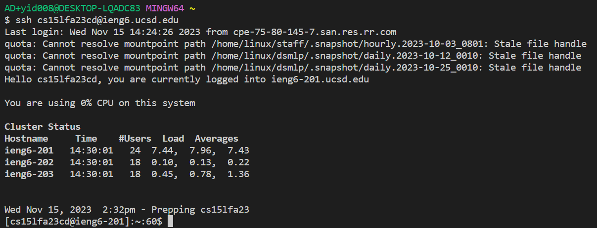
  To login ieng6, I typed the command "ssh cs15lfa23cd@ieng6.ucsd.edu" and then pressed the key <enter> to execute the command. Since I have set up the keys for easy access, I don't need to enter my password.
## Step 5: Clone your fork of the repository from your Github account
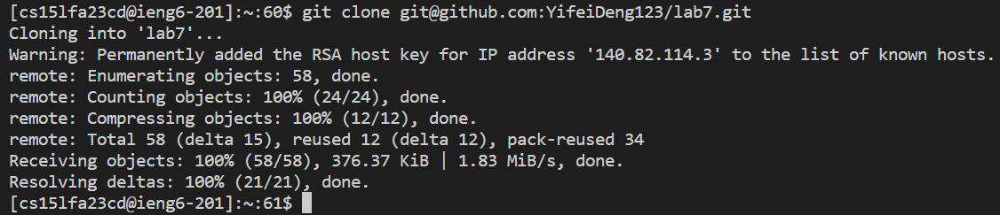
  To clone the repository, I first copied the SSH link from my GitHub. Next, I typed the command "git clone git@github.com:YifeiDeng123/lab7.git" and then pressed the key <return> to execute the command. 
## Step 6: Run the tests, demonstrating that they fail
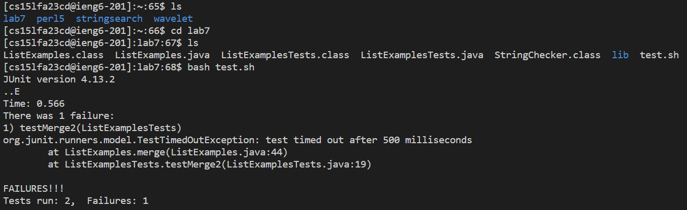
  To run the test, I first typed "ls" to check whether lab7 has been cloned successfully. Then I typed "cd lab7" to go into lab7's directory. Next, I typed "ls" to check the files in the folder of lab7. Finally, I typed the command "bash test.sh" and then pressed the key <enter> to execute the command. It shows that 2 tests were run but 1 test was failed.
## Step 7: Edit the code file to fix the failing test
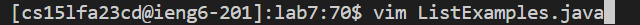
  To edit the code file, I first open ListExamples.java in vim by typing the command "vim ListExamples.java" and pressing the <enter> key.
  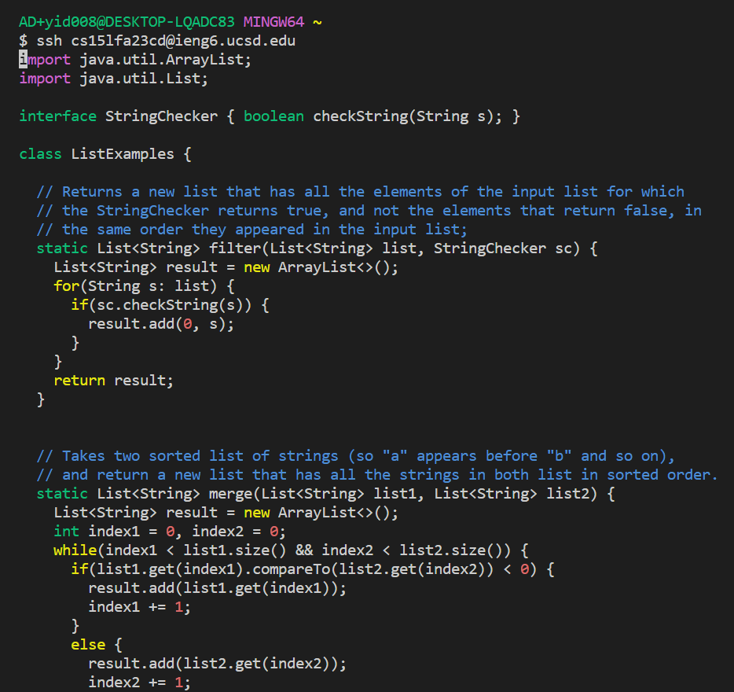
  Now I am in the normal mode of vim. First, I need to navigate to "index1" in the final loop in the merge method in order to change it to "index2". To do so, I press "<ctrl> + d" three times to get to the end of the code. 
  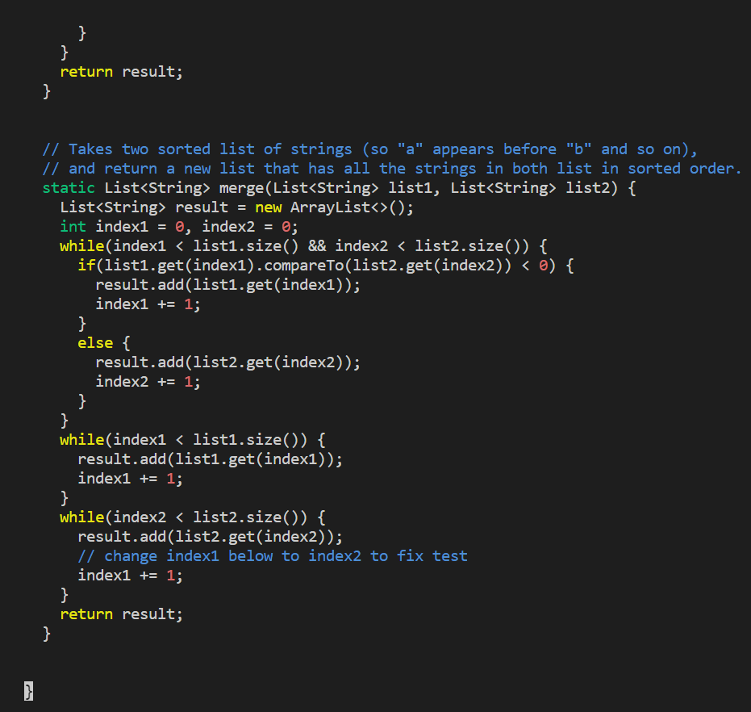
  Then I pressed up arrow key 6 times to get to the beginning of the line where I wanted to make a change. Next, I press "f" + "1" to  jump to just before the next occurrence using 1. Then I pressed the right arrow key to get to the place that I wanted to edit.   
  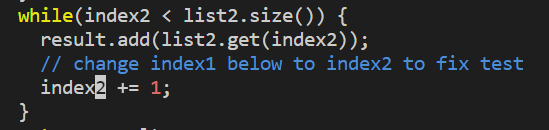
  After that, I pressed "i" to get into the insert mode. Next, I pressed <backspace> and typed "2" to change "index1" to "index2"
  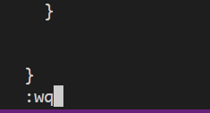
  Finally, I pressed the key <esc> to return to the normal mode and typed ":wq" to save and exit the vim.
## Step 8: Run the tests, demonstrating that they now succeed
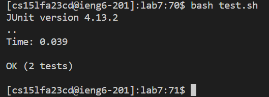
  To rerun the test, I pressed the up arrow key to retrieve my command history of "bash.sh". Then I pressed the <enter> key to run the test. Now both tests passed.
## Step 9: Commit and push the resulting change to your Github account
 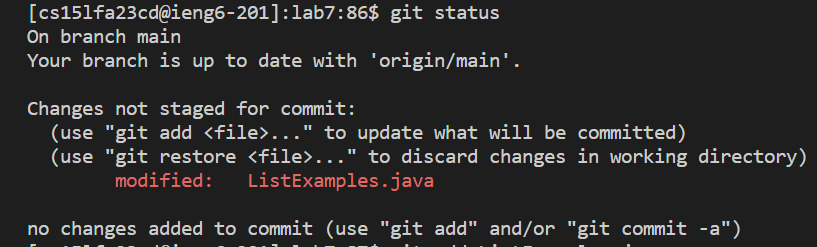
  Firstly, I typed "git status" to check the status of my file. As we can see, the ListExamples.java has been modified.  
  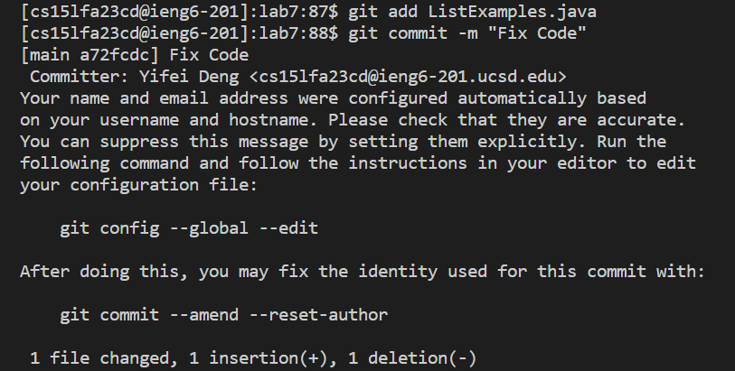
  Then, I typed "git add ListExamples.java" and pressed the <enter> key. Then I typed "git commit -m "Fix Code"" to commit my changes with the message "Fix Code". 
  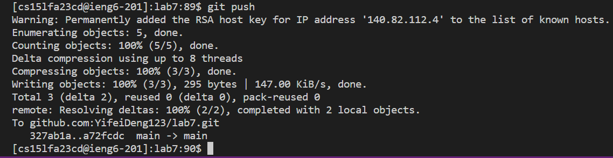
  Finally, I typed "git push" to push the resulting change to my GitHub account.  
  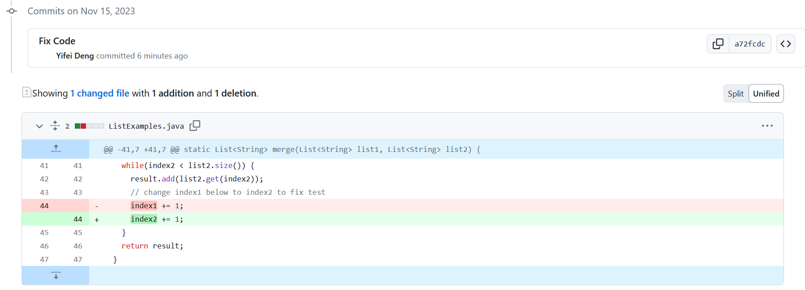
  As we can see, GitHub has shown the resulting change.
