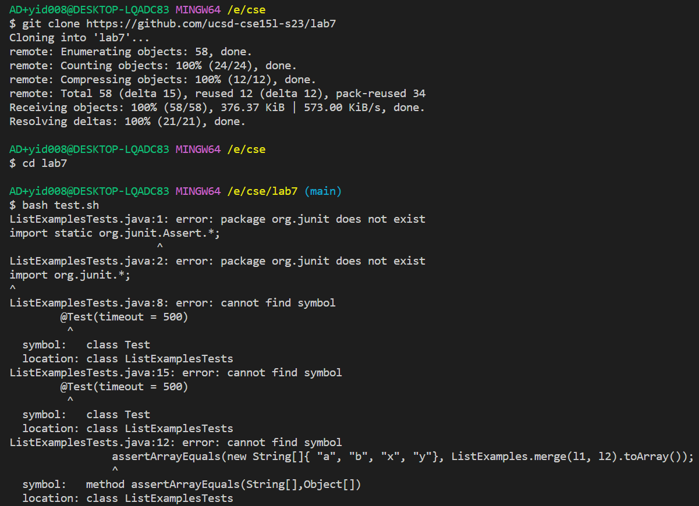
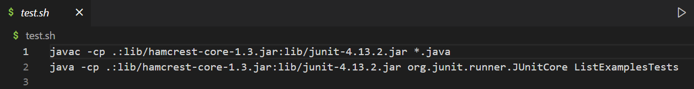
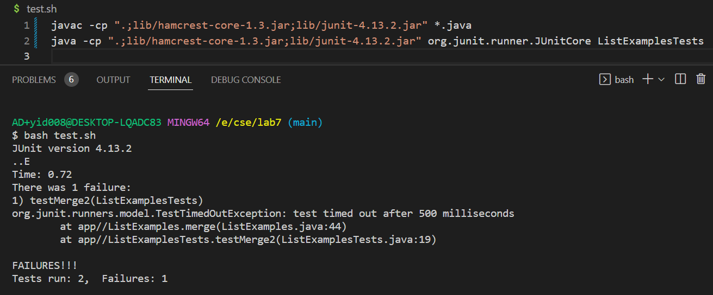
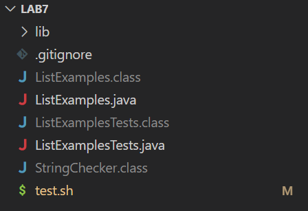
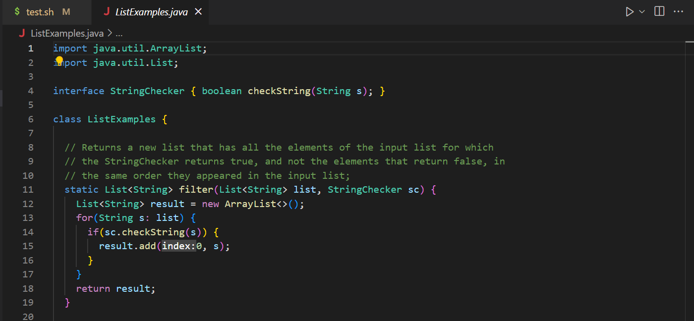
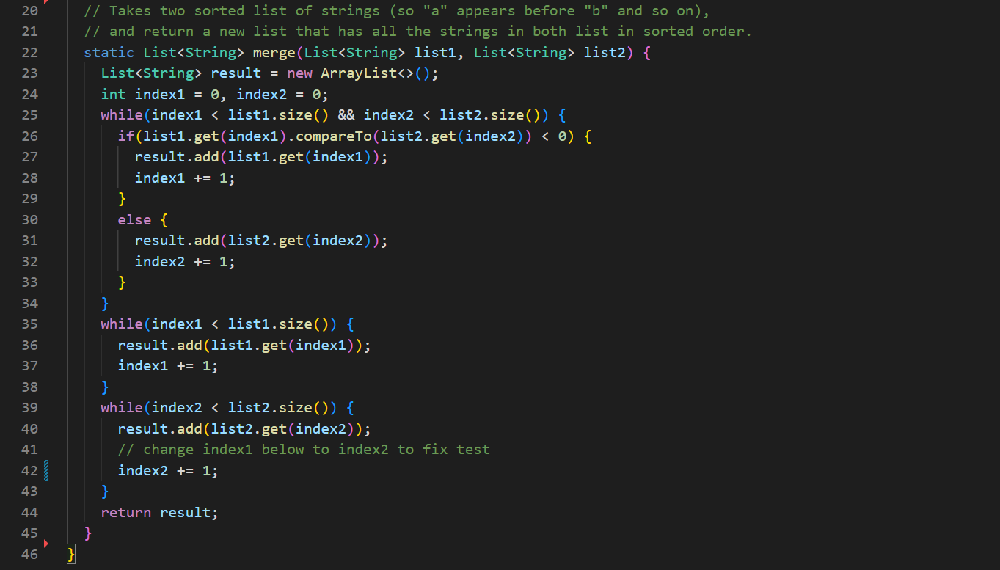
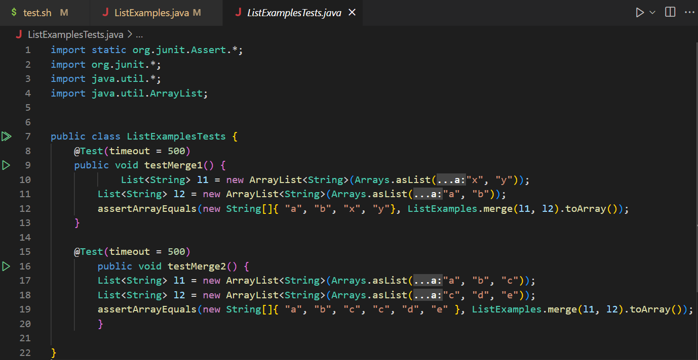

## Part 1
# 1. Student Post:
<br><br>
I am doing lab 7. I cloned the required code as instructed. The instructions asked me to fix some bugs in the codes. Before fixing the bug, I want to make sure that some tests do not fail. So I run "bash test.sh". But it gives me these errors.
Here is the test.sh I cloned from the code Professor provided.
<br><br>
What is the problem with it? I didn't change anything but only cloned the code.
# 2. TA Response:
Hi! I think the issue may caused by the system you are using. I believe you are using the Windows system but not the Mac system. The test.sh code provided by the Professor is for Mac users. However, the way to compile and run the Junit tests in commands is different for Windows and Mac users. Please refer to week 4 lab materials for correct commands in the Windows system.
# 3. Fix Bug:
<br><br>
Thank you very much! I do use the Windows system. I simply cloned the code from the Professor, where the codes in start.sh are used for Mac. I checked the webpage for week 4 and found out the correct command. I first changed all the ":" to ";" and then added backticks before ".;lib" and after ".jar". Now the command "bash test.sh" can successfully compile and run the ListExamplesTests.java.
# 4. Setup:
The file & directory structure needed:
<br><br>
The contents of each file before fixing the bug:
<br><br>

<br><br>

<br><br>

<br><br>

The full command line (or lines) you ran to trigger the bug:
```
AD+yid008@DESKTOP-LQADC83 MINGW64 /e/cse/lab7 (main)
$ bash test.sh
```
A description of what to edit to fix the bug:<br>
The things to edit to fix the bug are to change the two command lines in test.sh. The original ones are used to compile and run Junit tests in the Mac system. For the Windows users, we need to change ":" before each "lib" to ";". Also, we need to add backticks before each ".;lib" and after each".jar".
## Part 2
In the second half of this quarter, I think the most interesting thing I learned from this course is about the Vim. I never heard about Vim before. But after learning and using it, I feel it is very useful. That is because, with Vim, I could edit the file without opening it on my computer. Sometimes it is really hard to find a specific file if your computer has tons of files and folders. Also, Vin allows us to edit a file remotely via ssh, which is really convenient.
